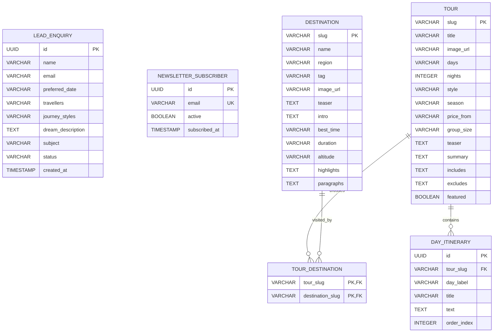
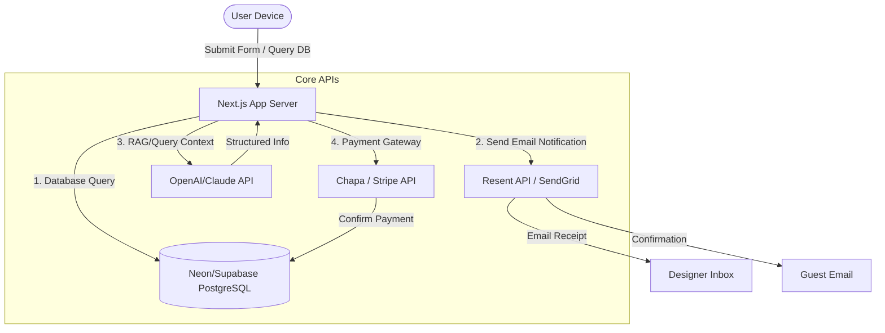

# Simien Ethiopia Tours: Backend Design & Planning Specification

This document provides a comprehensive technical blueprint for planning and implementing a secure, scaleable, and high-performance backend architecture for the **Simien Ethiopia Tours** platform. 

It transitions the frontend's static and state-driven features (Tours, Destinations, Layover Packages, Blog, Enquiry Forms, and the AI Chatbot) into a dynamic, production-ready, database-backed ecosystem.

---

## 1. Architectural Strategy Comparison

To best support the current Next.js (TypeScript/Tailwind/App Router) structure, we review three architectural directions:

| Metric | Option A: Next.js API Routes (Serverless) | Option B: Decoupled API Service (Node.js/Express or Go) | Option C: Backend-as-a-Service (Supabase) |
| :--- | :--- | :--- | :--- |
| **Development Speed** | 🚀 **Very Fast** (Monorepo, shared TS types) | ⚠️ **Slow** (Separate setups/deployment) | 🚀 **Fastest** (Visual DB, auto-generated SDK) |
| **Operational Overhead**| 🛡️ **Zero** (Managed by Vercel/Netlify) | 🛠️ **High** (Containerization, ECS/VPS) | 🛡️ **Low** (Fully managed database/auth) |
| **Database Connections**| ⚠️ **Tricky** (Ephemeral; needs Serverless pooling) | ✅ **Excellent** (Persistent connection pooling) | ✅ **Excellent** (Built-in pgBouncer/pooler) |
| **Realtime / Chat / WS** | ❌ **No** (Needs third-party, e.g., Pusher) | ✅ **Native** (Websockets, Socket.io) | ✅ **Native** (PostgreSql Listen/Notify) |
| **Ideal Use Case** | Content-heavy sites with lightweight forms. | High trade volume, web-sockets, heavy compute. | Quick MVP, rapid deployment, direct DB-to-client queries. |

### Architecture Recommendation
For **Simien Ethiopia Tours**, we recommend **Option A (Next.js App Router API Routes + Prisma/Drizzle ORM) combined with Neon Serverless Postgres** OR **Option C (Supabase)**. 
- Using Next.js API routes keeps the project in a single repository, allows sharing of typescript type definitions (like `Tour` and `Destination`), and fits natively with Next.js Server Components.
- A managed serverless database (like Neon or Supabase) handles arbitrary auto-scaling and connection limits.

---

## 2. Database Schema Design (PostgreSQL)

Since tours, itineraries, destinations, and bookings have complex relational constraints (e.g., tours traverse multiple destinations, and contain multiple day-by-day itineraries), a relational schema is required.

### Entity Relationship Diagram (ERD)



### Relational Table Definitions (SQL DDL)

```sql
-- 1. Destinations Table
CREATE TABLE destinations (
    slug VARCHAR(100) PRIMARY KEY,
    name VARCHAR(155) NOT NULL,
    region VARCHAR(100) NOT NULL,
    tag VARCHAR(50),
    image_url VARCHAR(255) NOT NULL,
    teaser TEXT NOT NULL,
    intro TEXT NOT NULL,
    best_time VARCHAR(100) NOT NULL,
    duration VARCHAR(50) NOT NULL,
    altitude VARCHAR(50) NOT NULL,
    highlights TEXT[] NOT NULL, -- Array of highlights
    paragraphs TEXT[] NOT NULL  -- Detailed text blocks
);

-- 2. Tours Table
CREATE TABLE tours (
    slug VARCHAR(100) PRIMARY KEY,
    title VARCHAR(155) NOT NULL,
    image_url VARCHAR(255) NOT NULL,
    days VARCHAR(50) NOT NULL,
    nights INT NOT NULL,
    style VARCHAR(100) NOT NULL,
    season VARCHAR(100) NOT NULL,
    price_from VARCHAR(100) NOT NULL, -- e.g. "$6,450 per person"
    group_size VARCHAR(100) NOT NULL, -- e.g. "2 - 8 guests"
    teaser TEXT NOT NULL,
    summary TEXT NOT NULL,
    includes TEXT[] NOT NULL,
    excludes TEXT[] NOT NULL,
    featured BOOLEAN DEFAULT FALSE
);

-- 3. Detailed Tour Itinerary (One-to-Many relation with Tours)
CREATE TABLE day_itineraries (
    id UUID PRIMARY KEY DEFAULT gen_random_uuid(),
    tour_slug VARCHAR(100) REFERENCES tours(slug) ON DELETE CASCADE,
    day_label VARCHAR(30) NOT NULL, -- e.g. "Day 1" or "Days 2 - 3"
    title VARCHAR(200) NOT NULL,
    text TEXT NOT NULL,
    order_index INT NOT NULL
);

-- 4. Tour - Destination Join Table (Many-to-Many relation)
CREATE TABLE tour_destinations (
    tour_slug VARCHAR(100) REFERENCES tours(slug) ON DELETE CASCADE,
    destination_slug VARCHAR(100) REFERENCES destinations(slug) ON DELETE CASCADE,
    PRIMARY KEY (tour_slug, destination_slug)
);

-- 5. Layover Packages Table
CREATE TABLE layover_packages (
    slug VARCHAR(100) PRIMARY KEY,
    hours VARCHAR(50) NOT NULL, -- e.g. "12 Hours"
    title VARCHAR(100) NOT NULL,
    price VARCHAR(100) NOT NULL,
    image_url VARCHAR(255) NOT NULL,
    teaser TEXT NOT NULL,
    itinerary TEXT[] NOT NULL,
    includes TEXT[] NOT NULL,
    best_for VARCHAR(100) NOT NULL
);

-- 6. Journal (Blog) Posts Table
CREATE TABLE posts (
    slug VARCHAR(100) PRIMARY KEY,
    title VARCHAR(255) NOT NULL,
    category VARCHAR(100) NOT NULL,
    published_date TIMESTAMP WITH TIME ZONE DEFAULT CURRENT_TIMESTAMP,
    read_time VARCHAR(30) NOT NULL,
    image_url VARCHAR(255) NOT NULL,
    author VARCHAR(155) NOT NULL,
    author_role VARCHAR(155) NOT NULL,
    excerpt TEXT NOT NULL,
    body TEXT[] NOT NULL,
    featured BOOLEAN DEFAULT FALSE
);

-- 7. Enquiry Submissions (Leads)
CREATE TYPE enquiry_status AS ENUM ('new', 'contacted', 'designing', 'booked', 'archived');

CREATE TABLE enquiries (
    id UUID PRIMARY KEY DEFAULT gen_random_uuid(),
    name VARCHAR(255) NOT NULL,
    email VARCHAR(255) NOT NULL,
    preferred_date VARCHAR(100),
    travellers VARCHAR(100),
    journey_styles VARCHAR(50)[] NOT NULL, -- e.g. ['Luxury', 'Cultural']
    dream_description TEXT,
    subject VARCHAR(200),                  -- e.g. "Lalibela" or "The Historic Route"
    status enquiry_status DEFAULT 'new',
    created_at TIMESTAMP WITH TIME ZONE DEFAULT CURRENT_TIMESTAMP
);

-- 8. Newsletter Subscribers
CREATE TABLE newsletter_subscribers (
    id UUID PRIMARY KEY DEFAULT gen_random_uuid(),
    email VARCHAR(255) UNIQUE NOT NULL,
    active BOOLEAN DEFAULT TRUE,
    subscribed_at TIMESTAMP WITH TIME ZONE DEFAULT CURRENT_TIMESTAMP
);
```

---

## 3. Core API Endpoints

All endpoints assume REST syntax. The base route is `/api`. Request and Response structures are typed to mesh with your current frontend components.

### 3.1 Public Content API

#### `GET /api/tours`
Retrieve all available tours. Accepts optional query filters.
- **Query Params**: `featured=true` (optional)
- **Response `200 OK`**:
  ```json
  [
    {
      "slug": "the-historic-route",
      "title": "The Historic Route",
      "days": "11 Days",
      "nights": 10,
      "style": "Cultural · Private",
      "price_from": "$6,450 per person",
      "group_size": "2 – 8 guests",
      "teaser": "Follow the pilgrimage of kings...",
      "featured": true
    }
  ]
  ```

#### `GET /api/tours/[slug]`
Retrieve full tour details, including day-by-day itineraries and list of visited destinations.
- **Response `200 OK`**:
  ```json
  {
    "slug": "the-historic-route",
    "title": "The Historic Route",
    "image": "/images/gondar.png",
    "days": "11 Days",
    "nights": 10,
    "style": "Cultural · Private",
    "season": "Oct – Mar",
    "from": "$6,450 per person",
    "group": "2 – 8 guests",
    "teaser": "Follow the pilgrimage...",
    "summary": "The definitive northern...",
    "includes": ["All domestic flights", "Private 4x4"],
    "excludes": ["International flights"],
    "itinerary": [
      { "day": "Day 1", "title": "Arrive Addis", "text": "Private transfer..." }
    ],
    "places": ["Lake Tana", "Gondar", "Simien Mountains"]
  }
  ```

---

### 3.2 Submissions & Forms API

#### `POST /api/enquiries`
Submits a dynamic itinerary planner or enquiry request fields.
- **Request Body**:
  ```json
  {
    "name": "Alex Mercer",
    "email": "alex@mercer.org",
    "when": "March 2027",
    "travellers": "2 adults",
    "selectedStyles": ["Luxury", "Adventure"],
    "dream": "Private coffee tasting in Kaffa",
    "subject": "Lalibela"
  }
  ```
- **Backend Action**: 
   1. Validates inputs using Schema validation runtime (e.g. Zod).
   2. Writes record to `enquiries` table.
   3. Sends notification email to `contact@simienethiopiatours.com` using email service (Resend).
   4. Sends confirmation email to user: `alex@mercer.org`.
- **Response `201 Created`**:
  ```json
  {
    "success": true,
    "message": "Enquiry submitted successfully",
    "enquiryId": "e38a2e12-b91c-4b68-b76b"
  }
  ```

#### `POST /api/newsletter/subscribe`
Allows users to subscribe to monthly journals.
- **Request Body**:
  ```json
  {
    "email": "reader@outlook.com"
  }
  ```
- **Response `200 OK` / `201 Created`**:
  ```json
  {
    "success": true,
    "message": "Subscription added"
  }
  ```

---

### 3.3 AI Support & Chatbot API

Currently, `floating-support.tsx` relies on hardcoded string matching. To turn this into a premium RAG-enabled AI Assistant, we design an external endpoint to handle conversational queries using LLMs and DB context.

#### `POST /api/support/chat`
Ask a question to the AI travel assistant.
- **Request Body**:
  ```json
  {
    "message": "When is the best time to see wolves in Bale?",
    "sessionId": "optional-uuid-prev-session"
  }
  ```
- **Backend Implementation Flow (Serverless Route)**:
  1. Retrieve chat history associated with `sessionId`.
  2. Embed tourist destinations and blogs (e.g., using `pgvector` index in Postgres) or inject general context from the `tours`, `destinations`, and `posts` tables.
  3. Send context-informed system prompt to OpenAI or Claude API:
     > *"You are the Simien AI Guide. Use the following travel catalog context: [...] to answer the guest's question. Focus on deep travel design, premium aesthetics, and direct WhatsApp links for booking."*
  4. Generate and stream the output to the client.
- **Response `200 OK`**:
  ```json
  {
    "text": "The best time to track the Ethiopian wolf on the Sanetti Plateau is between November and April. During these dry, clear months, the ground is ideal for sightings...",
    "sessionId": "4bb9cd1e-a4b0-4ce0-b98a-21147aab0281"
  }
  ```

---

## 4. Third-Party Services Integration Plan



1. **Email Service (Resend)**
   - Used for notifying the travel concierge team within 24 hours of form entries.
   - Set up custom domains for `@simienethiopiatours.com` to prevent emails landing in spam.
2. **Payment Gateway (Chapa API / Stripe API)**
   - Important for transacting the Layover packages. Chapa provides native support for Ethiopian Birr (ETB), Telebirr, and international cards.
3. **OpenAI API or Anthropic API**
   - Powering the `FloatingSupport` chatbot with custom assistant parameters.
4. **WhatsApp Business Cloud API (Meta)**
   - (Optional Future Dev) Trigger automatic booking templates or alert messages to designers when a VIP request is registered.

---

## 5. Security & Availability Best Practices

1. **Input Validation (Zod Validation)**:
   - Always run input validation checks on `/api/enquiries` and `/api/newsletter/subscribe` to block SQL injection and cross-site scripting (XSS).
2. **Rate Limiting**:
   - Use Middleware-based rate limiting (like `@upstash/ratelimit` over Redis) or Vercel rate limits for endpoints to avoid token exhaustion and brute-force query storms.
3. **Authentication & Admin Controls**:
   - Create a secure `/admin` route group using **NextAuth.js (Auth.js)** for designers to view customer enquiries, export logs, and edit tours. Keep passwords hashed using `bcrypt` or Argon2.
4. **Database Connection Management**:
   - Because serverless functions scale scale-to-zero, use connection pool strings like `pooling=true` or Prisma's Accelerate engine to prevent the backend from exhausting the maximum pool connections in high-traffic scenarios.
